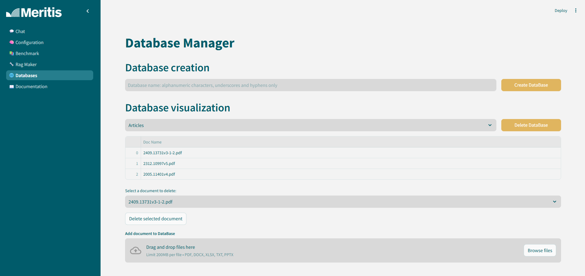
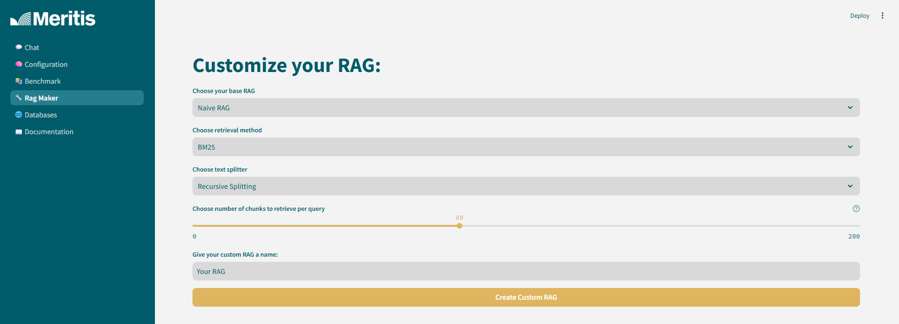
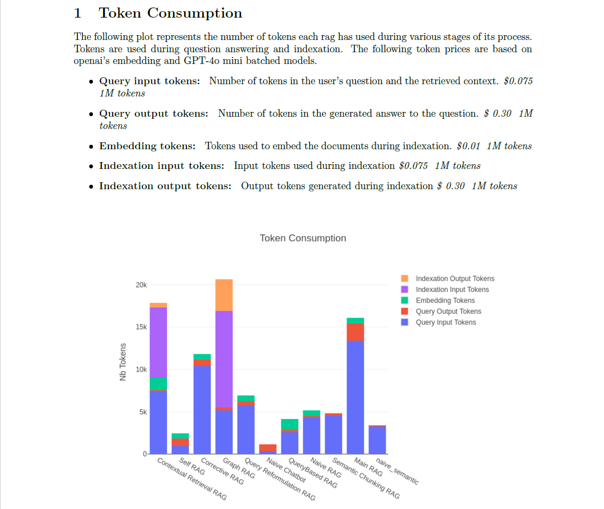

# OpenRAG by Meritis

Welcome to **OpenRAG**, an open source, user friendly RAG benchmark tool ! 

The goal a OpenRAG is to provide an intuitive tool to help users decide which RAG method, amongst the large number of existing techniques, is most appropriated to ist own use case and data.

In OpenRAG, more than a dozen RAG methods are implemented and more will be added with time. Each RAG can be customized to better fit each user's need. 

It can be used on the user's hardware or with a supported API key. Available LLM host are: 

- **Ollama** : requires a GPU
- **VLLM** : requires a GPU that supports cuda>=12.1
- **OpenAI** : requires an API key
- **Mistral** : requires an API key

## Launch commands
In oder to launch the app, follow these instruction to ensure a smooth running of the services. 
- Navigate to the `docker` folder by running `cd docker`

Upon launching, you can decide to launch all services or not. Here are the possible configurations: 
- `docker-compose-all.yml`: launches all services (Elasticsearch, the frontend, Ollama, and VLLM)
- `docker-compose-api.yml`: launches Elasticsearch and the frontend only; OpenAI and Mistral will be usable
- `docker-compose-ollama.yml`: launches only Elasticsearch, the frontend, and Ollama
- `docker-compose-vllm.yml`: launches Elasticsearch, the frontend, and VLLM

Once you have choosen a docker amongst the options above build it by running `sudo docker compose -f [DOCKER FILE NAME] up -d`

You can now access the app through the following URL: [http://localhost:8506/](http://localhost:8506/)

## App functionalities:

Once the app is up and running, you can now:

- Upload your own data

- Chat with your favorite RAG method, indexed on your database to roughly asses performances
- Customize each RAG method

- Benchmark selected methods and retrieved a quantitative report on their performances, their answering time, their energy consumption, greenhouse gas emissions and token consumption

### Contacts

For any question concerning the application, feel free to contact the developers at https://meritis.fr/expertise/innovation-ia/#block-form