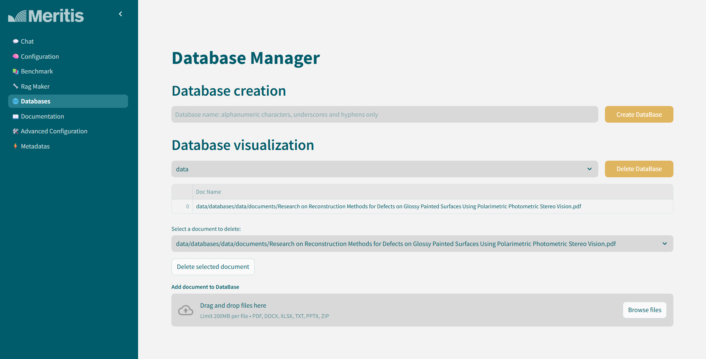
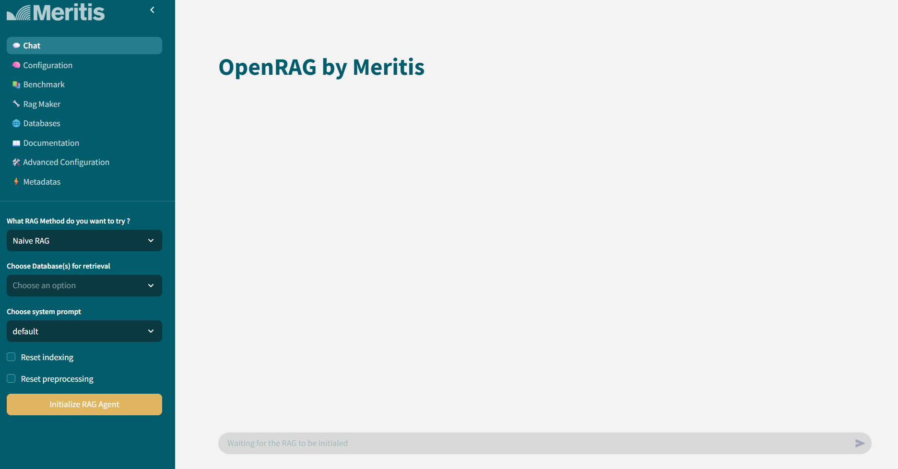
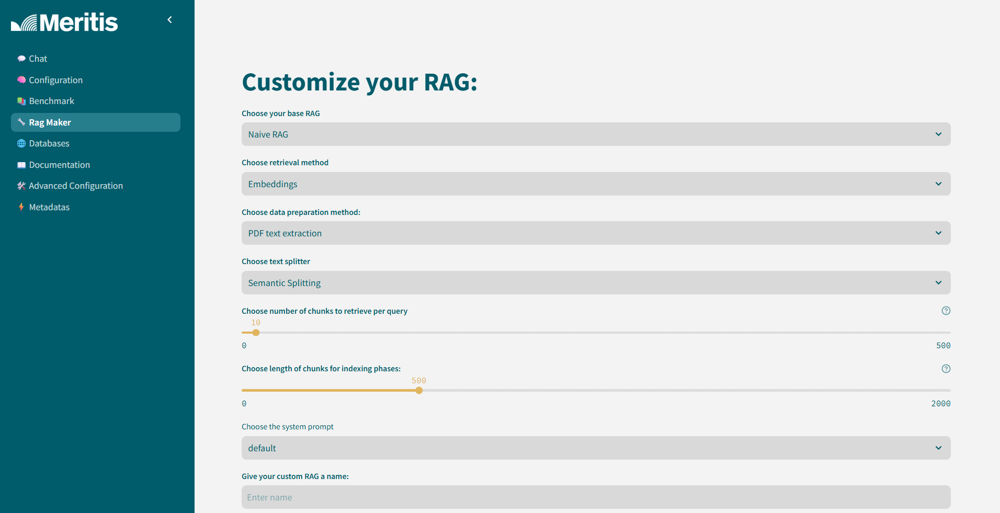

# OpenRAG by Meritis

Welcome to **OpenRAG**, an open source, user friendly RAG benchmark tool ! 

The goal of OpenRAG is to provide an intuitive tool to help users decide which RAG method, amongst the large number of existing techniques, is most appropriated to ist own use case and data.

In OpenRAG, more than a dozen RAG methods are implemented and more will be added with time. Each RAG can be customized to better fit each user's need. 

It can be used on the user's hardware or with a supported API key. Available LLM host are: 

- **Ollama** : requires a GPU
- **VLLM** : requires a GPU that supports cuda>=12.1
- **OpenAI** : requires an API key

## Launch commands

### Prerequisites
- Docker and Docker Compose installed
- Elasticsearch instance (local or remote)
- API keys for LLM providers or (local or remote) GPU for Ollama/VLLM

### Start the application

1. **Start the backend**:
   ```bash
   cd backend
   docker compose up -d
   ```

2. **Start the frontend**:
   ```bash
   cd frontend
   docker compose up -d
   ```

3. **Access the application**: [http://localhost:8502/](http://localhost:8502/)

### Configuration

On first use, go to the **Configuration** page to set up:
- **Elasticsearch**: URL and credentials
- **LLM providers**: 
  - **Ollama**: requires a GPU
  - **VLLM**: requires a GPU with CUDA >=12.1
  - **OpenAI**: requires an API key
- **Embedding and Reranker models**

## App functionalities:

Once the app is up and running, you can now:

- Upload your own data

- Chat with your favorite RAG method, indexed on your database to roughly asses performances

- Customize each RAG method

- Benchmark selected methods and retrieved a quantitative report on their performances, their answering time, their energy consumption, greenhouse gas emissions and token consumption


### Contacts

For any question concerning the application, feel free to contact the developers at https://meritis.fr/expertise/innovation-ia/#block-form
