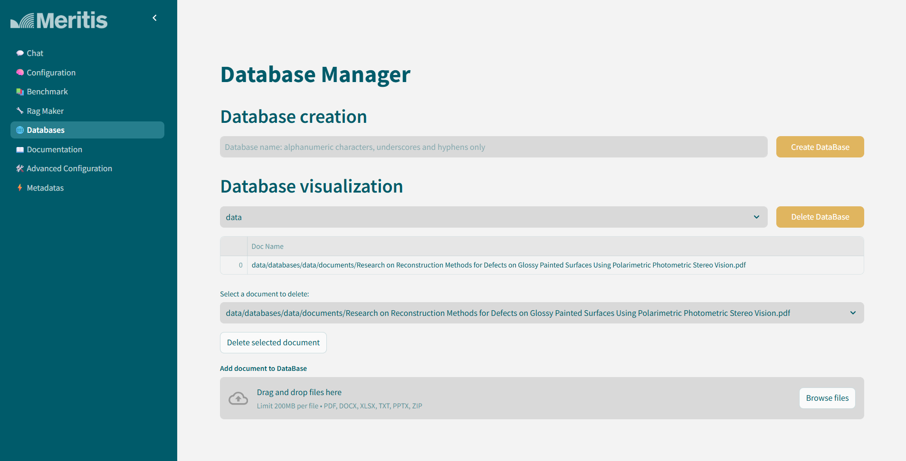
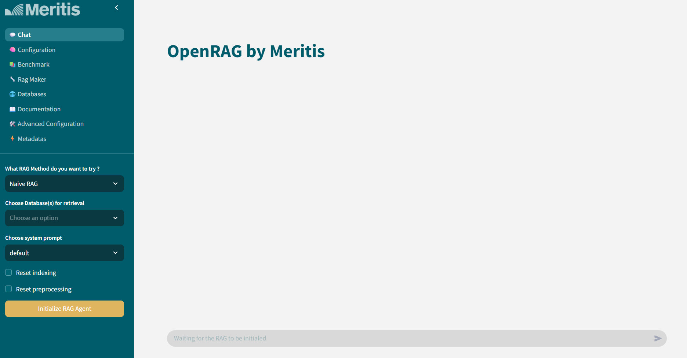
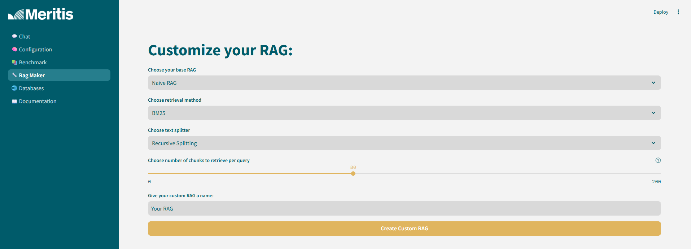
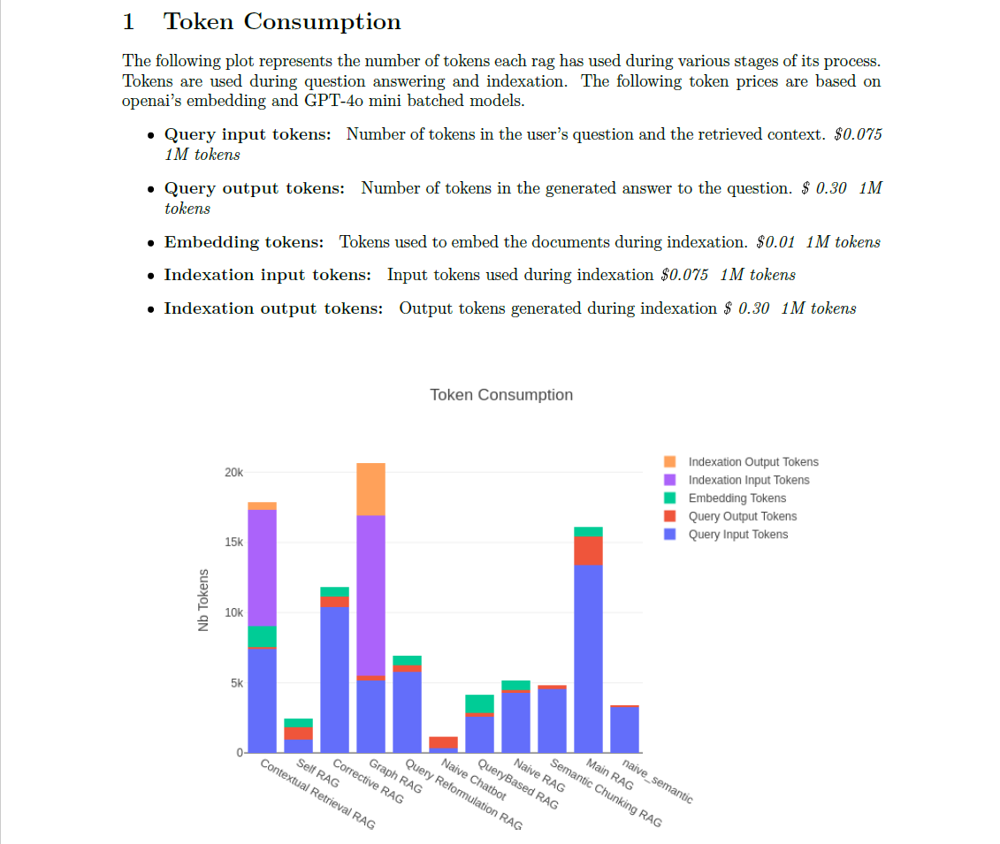

# OpenRAG by Meritis

Welcome to **OpenRAG**, an open source, user friendly RAG benchmark tool !

The goal of OpenRAG is to provide an intuitive tool to help users decide which RAG method, amongst the large number of existing techniques, is most appropriated to ist own use case and data.

In OpenRAG, 15 RAG methods are implemented and more will be added with time. Each RAG can be customized to better fit each user's need:

- **Naive RAG** - Basic retrieval-augmented generation
- **Advanced RAG** - Enhanced RAG with advanced features
- **Graph RAG** - Graph-based retrieval using entity relationships
- **HyDE RAG** - Hypothetical Document Embedding
- **Self RAG** - Self-reflective RAG with retrieval feedback
- **Corrective RAG** - Corrective retrieval with web crawling fallback
- **Contextual Retrieval RAG** - Context-aware document retrieval
- **Agentic RAG** - Agent-based RAG with tool usage
- **Merger RAG** - Combines multiple RAG methods
- **Query Reformulation** - Query optimization and expansion
- **Semantic Chunking RAG** - Semantic-based document chunking
- **Reranker RAG** - RAG with result reranking
- **Query-based RAG** - Query-focused retrieval
- **Naive Chatbot** - Simple chatbot without retrieval
- **Agentic RAG Router** - Intelligent routing between RAG methods

It can be used with a supported API key. Available LLM providers are:

- **OpenAI** : requires an API key
- **Custom (OpenAI-compatible)** : for other OpenAI-compatible providers or local LLM deployments like vLLM, SGLang, Ollama, LM Studio

## YouTube Tutorial

You can see our tutorial on youtube to how to install and use OpenRAG to start your first benchmark

[](https://youtu.be/i9Xyarj-fFQ)

## 🚀 Quick Start Guide

Get OpenRAG up and running in 15-20 minutes with this step-by-step guide.

### Step 1: Prerequisites Setup (5 min)

#### 1.1 Install Docker
- **Windows/Mac:** Download [Docker Desktop](https://www.docker.com/products/docker-desktop)
- **Linux:** 
  ```bash
  curl -fsSL https://get.docker.com | sh
  ```
- Verify installation: `docker --version`

#### 1.2 Start Elasticsearch
```bash
docker compose -f docker-compose.elasticsearch.yml up -d
```

Verify it's running:
```bash
curl http://localhost:9200
```

**Default credentials:**
- URL: `http://localhost:9200`
- User: `elastic`
- Password: `openrag`

#### 1.3 Get API Keys

Choose your provider(s):

| Provider | Get API Key |
|----------|-------------|
| **OpenAI** | [platform.openai.com/api-keys](https://platform.openai.com/api-keys) |
| **Ollama** | No key needed (local) |

> 💡 **Tip:** Start with Ollama, vLLM, SGLang, or LM Studio to test locally.

---

### Step 2: Launch OpenRAG (2 min)

#### 2.1 Start the Backend
```bash
cd backend
docker compose up -d
```

Verify: `docker logs openrag-backend` (should show "Application startup complete")

#### 2.2 Start the Frontend
```bash
cd frontend
docker compose up -d
```

#### 2.3 Access the Application
Open your browser: [http://localhost:8502](http://localhost:8502)

You should see the OpenRAG dashboard.

---

### Step 3: Initial Configuration (10 min)

Navigate to **Configuration page** (⚙️ icon in sidebar or "2_🧠_configuration" tab)

> ⚠️ **Docker Networking:** Since OpenRAG runs in Docker containers, use `host.docker.internal` instead of `localhost` when connecting to services on your host machine (Elasticsearch, Ollama, vLLM, etc.).
> 
> | From | To host service | URL example |
> |------|----------------|-------------|
> | Host machine | Host service | `http://localhost:9200` |
> | Docker container | Host service | `http://host.docker.internal:9200` |

#### 3.1 Configure Elasticsearch

In the **"Vectorbase Configuration"** section (scroll down):

- **URL Elasticsearch:** `http://host.docker.internal:9200`
- **Auth:** `elastic`
- **Clé API:** `openrag` (or your custom password)

Click **"💾 Save elasticsearch params"**

✅ You should see: "Elasticsearch connection successful!"

---

#### 3.2 Configure LLM Provider

In the **"API/Models Configuration"** section (top of page):

Click **"➕ Add a new model"** and choose your provider:

##### **Option A: OpenAI** (Cloud)

1. **Get API key:** [platform.openai.com/api-keys](https://platform.openai.com/api-keys)
2. In OpenRAG, fill:
   - **Model name:** `gpt-4o-mini`
   - **Model type:** `llm`
   - **Provider:** `openai`
   - **API Key:** `sk-proj-...` (paste your key)
3. Click **"Add model"**

**Available models:**
- `gpt-4o-mini` - Fast, cheap (~$0.15/1M tokens)
- `gpt-4o` - More capable (~$2.50/1M tokens)
- `gpt-4-turbo` - Most powerful

##### **Option B: Local LLMs** (Privacy-friendly)

Choose one of the following local providers:

<details>
<summary><b>Ollama</b></summary>

1. **Install Ollama:** [ollama.ai](https://ollama.ai)
2. **Download a model:**
   ```bash
   ollama pull llama2
   ```
3. **Start Ollama server:**
   ```bash
   ollama serve
   ```
   (Runs on `http://localhost:11434`)

4. In OpenRAG, fill:
   - **Model name:** `llama2` (or any model you pulled)
   - **Model type:** `llm`
   - **Provider:** `custom (openaiSDK-compatible)`
   - **Model URL:** `http://host.docker.internal:11434/v1`
   - **API Key:** `ollama` (any non-empty value)
5. Click **"Add model"**

**Popular models:**
- `llama2` - Meta's Llama 2 (7B parameters)
- `mistral` - Mistral 7B
- `codellama` - Code-specialized
- `gemma:2b` - Lightweight (2B parameters)
</details>

<details>
<summary><b>vLLM</b> (High performance)</summary>

1. Install vLLM: `pip install vllm`
2. Start server:
   ```bash
   vllm serve <model_name> --host 0.0.0.0 --port 8000
   ```
3. In OpenRAG, fill:
   - **Model name:** Your model name (e.g., `meta-llama/Llama-2-7b-hf`)
   - **Model type:** `llm`
   - **Provider:** `custom (openaiSDK-compatible)`
   - **Model URL:** `http://host.docker.internal:8000/v1`
   - **API Key:** `dummy` (any non-empty value)
4. Click **"Add model"**
</details>

<details>
<summary><b>SGLang</b> (Optimized throughput)</summary>

1. Install SGLang: `pip install sglang`
2. Start server:
   ```bash
   python -m sglang.launch_server --model <model_name> --host 0.0.0.0 --port 8000
   ```
3. In OpenRAG, fill:
   - **Model name:** Your model name
   - **Model type:** `llm`
   - **Provider:** `custom (openaiSDK-compatible)`
   - **Model URL:** `http://host.docker.internal:8000/v1`
   - **API Key:** `dummy` (any non-empty value)
4. Click **"Add model"**
</details>

<details>
<summary><b>LM Studio</b> (GUI-based)</summary>

1. Download LM Studio: [lmstudio.ai](https://lmstudio.ai)
2. Start local server:
   - Open LM Studio
   - Go to "Local Server" tab
   - Load a model and click "Start Server" (default port 1234)
3. In OpenRAG, fill:
   - **Model name:** The model you loaded
   - **Model type:** `llm`
   - **Provider:** `custom (openaiSDK-compatible)`
   - **Model URL:** `http://host.docker.internal:1234/v1`
   - **API Key:** `dummy` (any non-empty value)
4. Click **"Add model"**
</details>

---

#### 3.3 Configure Embedding Model

**What it does:** Converts text to vectors for semantic search.

Still in **"API/Models Configuration"**, click **"➕ Add a new model"**:

**Recommended by provider:**

| Provider | Model Name | Type | Notes |
|----------|-----------|------|-------|
| OpenAI | `text-embedding-3-small` | embedding | Best quality/cost |
| Ollama | `all-minilm:22m` | embedding | Local, fast |

**Example configuration (OpenAI):**
- **Model name:** `text-embedding-3-small`
- **Model type:** `embedding`
- **Provider:** `openai`
- **API Key:** Same as your LLM key

Click **"Add model"**

---

#### 3.4 Assign Models to Roles

In the **"Model role configuration"** section (middle of page):

For each role, select the model you just created:

- **Model for Base LLM:** Select your LLM (e.g., `gpt-4o-mini`)
- **Model for Embedding model:** Select your embedding model (e.g., `text-embedding-3-small`)
- **Model for Reranker:** Optional (leave as "No model" for now)
- **Model for image description:** Optional (leave as "No model")

You should see ✅ next to each configured role.

---

#### 3.5 Configure Reranker (Optional)

**What it does:** Improves search relevance by reordering results.

**Option 1: No reranker (simplest)**
- Leave as "No model" in Model role configuration
- Works fine for basic use cases

**Option 2: Local reranker**

Requires a separate reranker server running. Example:
- **Model name:** `BAAI/bge-reranker-v2-m3`
- **Model type:** `reranker`
- **Provider:** `custom (openaiSDK-compatible)`
- **Model URL:** `http://host.docker.internal:8003`
- **API Key:** `dummy`

---

### Step 4: Verify Configuration (2 min)

#### 4.1 Test Model Availability

In the **"Configured models availability"** section (bottom of Configuration page):

1. Click **"🔄 Check availability"** button
2. Wait 5-10 seconds for tests to complete

**Expected results:**
```
🟢 Base LLM
✅ gpt-4o-mini is available

🟢 Embedding model
✅ text-embedding-3-small is available

🟢 Reranker
✅ No model configured (or your reranker)
```

#### 4.2 Troubleshooting Errors

If you see ❌ errors:

| Error | Solution |
|-------|----------|
| **Cannot connect to server** | Check URL and network. For Ollama, ensure `ollama serve` is running |
| **Invalid API key** | Verify key is correct (no extra spaces). Check provider dashboard |
| **Model not found** | Verify model name matches exactly (case-sensitive) |
| **Connection refused** | For Elasticsearch, try `host.docker.internal` instead of `localhost` |

---

### Step 5: Test with Your First RAG (5 min)

#### 5.1 Save Configuration

At the bottom of Configuration page:

1. Click **"💾 Save default models"** (saves model roles)
2. Click **"Save Configuration"** (saves all settings)

✅ You should see: "Configuration saved"

#### 5.2 Upload Documents

1. Navigate to **Databases page** (📚 "5_🌐_databases" tab)
2. Enter a **Database name** (e.g., "my-first-rag")
3. Click **"Create database"**
4. Upload a PDF file:
   - Click **"Browse files"**
   - Select a PDF document
   - Click **"Upload"**
5. Wait for indexing to complete (30 seconds - 2 minutes depending on file size)

#### 5.3 Chat with Your RAG

1. Navigate to **Chat page** (💬 "1_💬_chat" tab)
2. Select your database from dropdown
3. Choose a **RAG method** (start with "Naive RAG")
4. Ask a question about your document:
   - Example: "What is this document about?"
   - Example: "Summarize the main points"
5. See the AI response with sources!

#### 5.4 Experiment with Different RAGs

In the Chat page, try different RAG methods:

- **Naive RAG** - Basic retrieval
- **HyDE RAG** - Better for complex queries
- **Reranker RAG** - More accurate results (if reranker configured)
- **Graph RAG** - Good for entity relationships

Compare response quality and speed!

---

## 🎉 You're Ready!

You've successfully:
- ✅ Configured Elasticsearch
- ✅ Set up an LLM provider
- ✅ Configured embeddings
- ✅ Uploaded documents
- ✅ Asked your first question

**Next steps:**
- **Customize RAGs:** Go to RAG Maker page (🔧) to tune parameters
- **Benchmark methods:** Go to Benchmark page (📚) to compare performance
- **Add more databases:** Upload different document collections

**Need help?** Check the [Troubleshooting](#troubleshooting) section or contact support.

---

## 📋 Quick Reference

### Important URLs

| Service | URL |
|---------|-----|
| OpenRAG UI | http://localhost:8502 |
| Backend API | http://localhost:8000 |
| Elasticsearch | http://localhost:9200 |
| Ollama (if used) | http://localhost:11434 |

### Key Configuration Files

```bash
backend/data/models_infos.json        # Model configurations
backend/data/base_config_server.json  # Server settings
backend/data/providers_infos.json     # Provider API keys
```

---

## ❓ Troubleshooting

### Common Issues

<details>
<summary><b>Elasticsearch connection failed</b></summary>

**Error:** `❌ Elasticsearch connection failed: Connection refused`

**Solutions:**
1. Check Elasticsearch is running:
   ```bash
   curl http://localhost:9200
   docker ps | grep elasticsearch
   ```
2. In OpenRAG config, use `http://host.docker.internal:9200` (not localhost)
3. Verify credentials (elastic / openrag)
4. Check Docker logs: `docker logs openrag-elasticsearch`

</details>

<details>
<summary><b>Model not available</b></summary>

**Error:** `❌ Model not available: Cannot connect to server`

**Solutions:**
- **For OpenAI:** Verify API key is valid and has credits
- **For local models (Ollama, vLLM, SGLang, LM Studio):**
  - Ensure the server is running
  - Use `http://host.docker.internal:PORT/v1` instead of `http://localhost:PORT/v1` in Model URL
- Check network connectivity
- Try with a different model

</details>

<details>
<summary><b>Backend not connected</b></summary>

**Error:** `⚠️ Backend not connected`

**Solutions:**
1. Check backend is running: `docker ps | grep openrag-backend`
2. View logs: `docker logs openrag-backend`
3. Restart: `cd backend && docker compose restart`
4. Verify port 8000 is free: `lsof -i :8000`

</details>

<details>
<summary><b>Docker issues</b></summary>

**Error:** `Cannot connect to Docker daemon`

**Solutions:**
- Start Docker Desktop (Windows/Mac)
- Linux: `sudo systemctl start docker`
- Verify: `docker ps`
- Restart Docker if needed

</details>

### Getting Help

1. **Check logs:**
   ```bash
   docker logs openrag-backend     # Backend logs
   docker logs openrag-frontend    # Frontend logs
   ```

2. **Restart everything:**
   ```bash
   # Backend
   cd backend && docker compose restart
   
   # Frontend
   cd frontend && docker compose restart
   
   # Elasticsearch
   docker compose -f docker-compose.elasticsearch.yml restart
   ```

3. **Contact support:**
   - Email: https://meritis.fr/expertise/innovation-ia/#block-form
   - Check existing issues on GitHub

---

## 🎓 Next Steps

Now that you're configured, explore these features:

### 1. Upload Documents (Databases page)
- Supported formats: PDF, Markdown
- Tips: Smaller chunks (500-1000 chars) for better retrieval
- Use semantic splitting for natural boundaries

### 2. Chat with Different RAGs (Chat page)
- Start with Naive RAG
- Try HyDE for complex queries
- Use Reranker for accuracy
- Experiment with Graph RAG for relationships

### 3. Customize RAG Parameters (RAG Maker page)
- Adjust chunk size and overlap
- Change retrieval methods (hybrid, BM25, embeddings)
- Tune number of chunks to retrieve

### 4. Run Benchmarks (Benchmark page)
- Compare multiple RAG methods
- Get metrics: accuracy, speed, energy consumption
- Download reports

### 5. Advanced Features
- **Query reformulation:** Enable in Configuration for better queries
- **Merge RAGs:** Combine multiple methods in RAG Maker
- **Custom system prompts:** Modify AI behavior

## App functionalities

Once the app is up and running, you can now:

- Upload your own data

- Chat with your favorite RAG method, indexed on your database to roughly asses performances

- Customize each RAG method (parameters, embedding models, chunking strategies, etc.)

- Merge multiple RAG methods to create hybrid approaches and compare their performance
- Benchmark selected methods and retrieved a quantitative report on their performances, their answering time, their energy consumption, greenhouse gas emissions and token consumption


### Contacts

For any question concerning the application, feel free to contact the developers at <https://meritis.fr/expertise/innovation-ia/#block-form>
